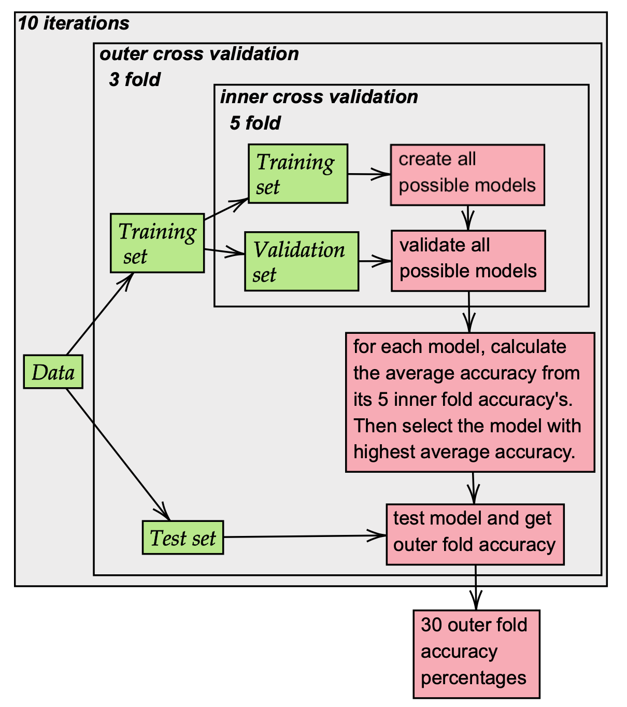
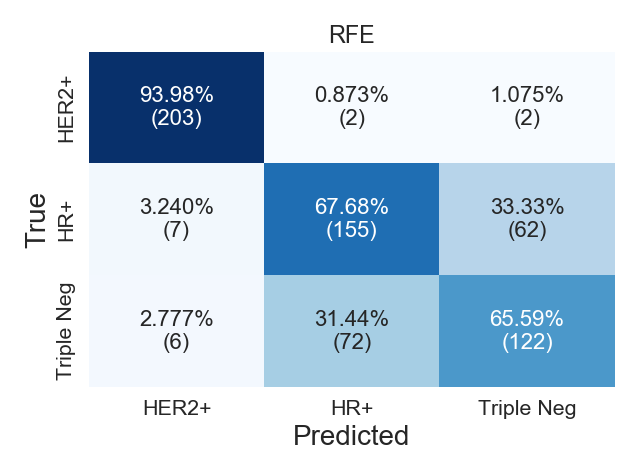

# Code Sample Bioinformatics project

This GitHub page contains the project I did during a bioinformatics course. We used machine learning to classify subtypes of breast cancer within patients.

## Overview
```
codesample
│   ├── data                        Contains patient data
|   ├── figures                     Contains figures shown in this README file
│   ├── results                     
│   │      ├── features             Contains feature selection results
│   │      ├── runs                 Contains result data of the cross validation
│   ├── html                        Contains html files for figures
│   ├── js                          Contains JavaScript files to create figures
│   ├── index.html                  Contains direct links to html files
│   ├── nested_cross_validation.py  Python file with nested cross validation
│   ├── train_final_model.py        Python file where the final model is trained


```

## Brief summary of the project
During this project, we obtained the data of 100 breast cancer patients and were asked
to create a model that would be able to classify the samples into different breast cancer subtypes.
This project investigated three feature selection methods and used a Support
Vector Machine as a classification method. Using nested cross validation, the accuracy of the feature selection methods and several parameter settings was tested.

<html>
<p align="center">

</p>
</html>

Ultimately, the best feature selection method and corresponding parameter set were chosen based on the accuracy scores that were found during cross validation.
We classified the breast cancer patients and created a confusion matrix of the results. The predicted class is shown on the X-axis
and on the Y-axis the true class can be observed.

<html>
<p align="center">
  
</p>
</html>

Lastly, to manually investigate which features were selected most often,
an interactive frequency heat map was created with. This heatmap can be viewed [here](https://annemijnd.github.io/codesample/1_Bioinformatics_in_Translational_Medicine/html/heatmap_RFE.html). In the upper graph, the features are sorted
by frequency. In the bottom graph, they are ordered by feature number.

### Files and code
```
codesample
│   ├── data
|   ├── figures
│   ├── results
│   │      ├── features
│   │      ├── runs
│   ├── html
│   ├── js
│   ├── index.html
│   ├── nested_cross_validation.py
│   ├── train_final_model.py


```


## 2. Datamining
