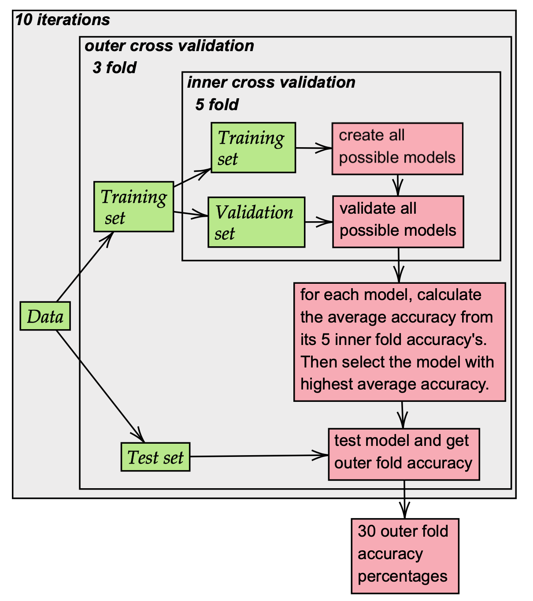

# Code Sample

## Files
This folder contains the projects of two courses I followed during my master's.
1. Bioinformatics in Translational Medicine
2. Datamining

## 1. Bioinformatics in Translational Medicine

### Brief summary of the project
During this project, we obtained the data of breast cancer patients and were asked
to create a model that would be able to classify the samples into different breast cancer subtypes.
This project investigated three feature selection methods and used a Support
Vector Machine as a classification method. Using nested cross validation, the accuracy of the feature selection methods and several parameter settings was tested.

Ultimately, the best feature selection method and corresponding parameter set were chosen based on the accuracy scores that were found during cross validation.
We classified the breast cancer patients and created a confusion matrix of the results. The predicted class is shown on the X-axis
and on the Y-axis the true class can be observed.

### Files and code

## 2. Datamining
